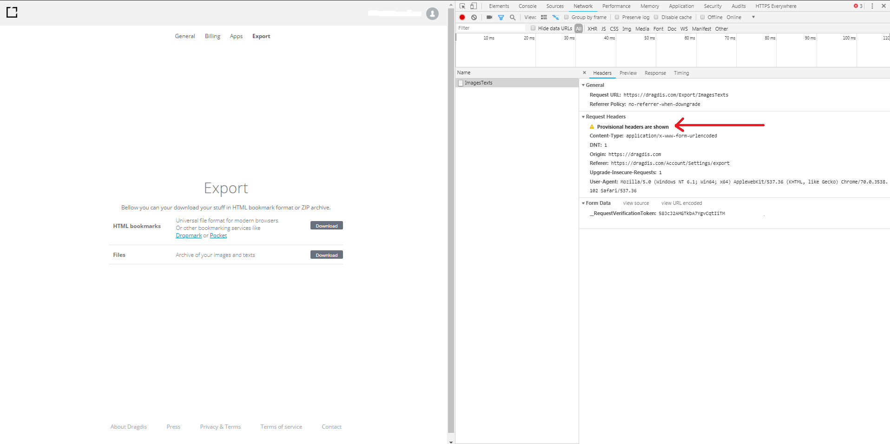
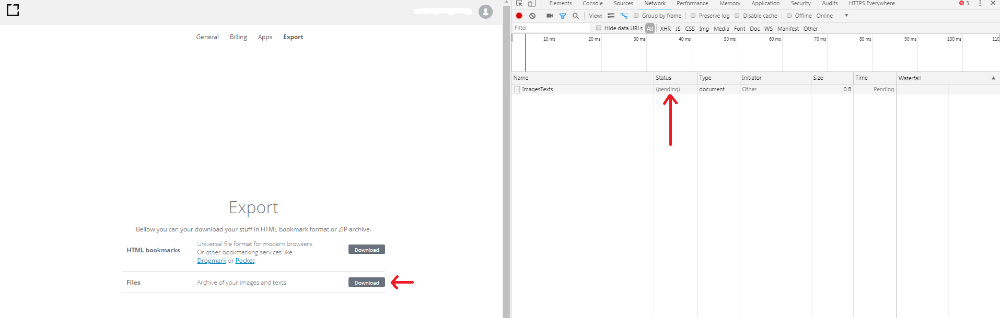
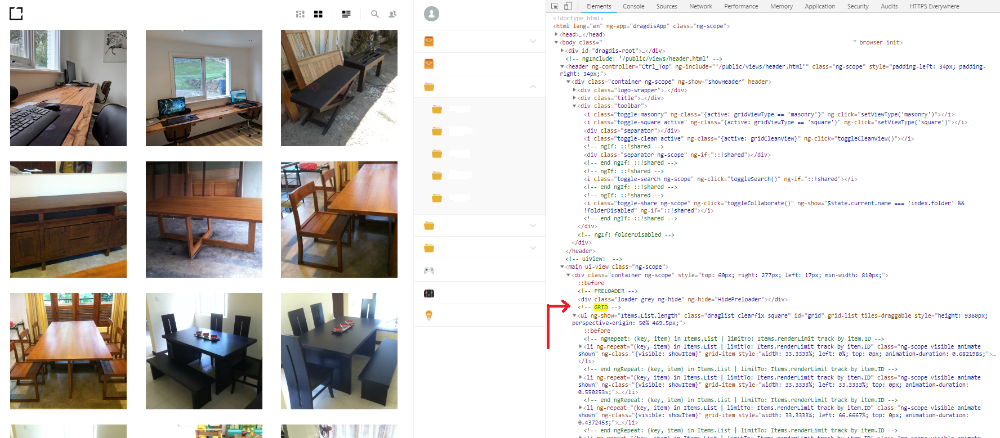
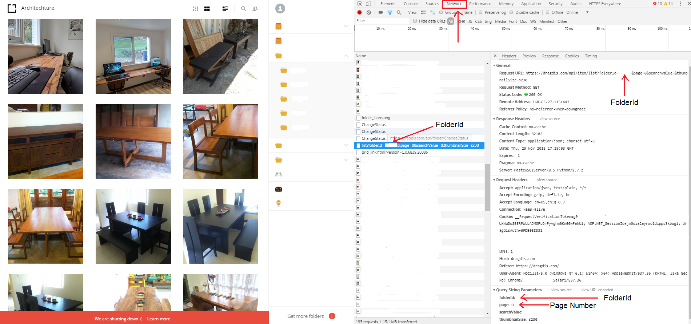

# Dragdis scrapy export script

The intention of this project is to export the data stored in Dragdis bookmarking service since they have announced that their service is going to shutdown on December 2018. Since the official export functionality fails to export the data stored in some Dragdis accounts, this scarpy script was written. The intention of this script is not to abuse the Dragdis API but to move the stored data in Dragdis servers prior to shutdown. 


### Screen shots of an export failed account





## Getting Started

This script uses scrapy framework as underleying framework.
Scrapy is a scraping and web crawling framework.

### Prerequisites

A registered Dragdis account needs to be available.
In your machine/environment scrapy framework needs to be available.
In order to install scrapy, pip or Anaconda distribution can be used.

```
Give examples
```

### Installing

If you have pip available use bellow command to install scrapy

```
pip install scrapy
```

If you have Anaconda then use the following command.

```
conda install -c conda-forge scrapy
```

While installing scrapy if you encounter a problem related to "Microsoft Visual C++ 14.0" please follow the steps mentioned in [this stackoverflow answer](https://stackoverflow.com/questions/29846087/microsoft-visual-c-14-0-is-required-unable-to-find-vcvarsall-bat/47935574#47935574) to solve it.


After installing scrapy is done, a project needs to be created.
```
scrapy startproject dragdis_recover
```

Then step into the newly created directory.
```
cd dragdis_recover
```

To create a scrape spider executed the following command.
```bash
scrapy genspider dragspider dragdis.com
```

After the above command is executed the directory structure will be as follows.

```
dragdis_recover
│   scrapy.cfg
└───dragdis_recover
    │   __init__.py
    │   items.py
    │   middlewares.py
    │   pipelines.py
    │   settings.py
    └───spiders
        │   __init__.py
        │   dragspider.py
```

Replace the "dragspider.py" file which resided in spiders folder with the dragspider.py file in this repository. In "dragspider.py" file replace the following User Name and Password credentials section with your information. 

```python
        data = {
            "Username": 'ReplaceThisWithUserName',
            "Password": 'ReplaceThisWithPassword',
            "__RequestVerificationToken": token
        }
```

Also replace the "settings.py" with the content of settings.py file. The settings.py file has updated the default timeout request time from 180 seconds to 1024 seconds. This will avoid timeout request exceptions. 


## How to use the script

The parameters of the following command is explained in bellow sections.

```
scrapy crawl dragspider -a folder_id=123456 -a start_page_number=0 -a max_page_number=2
```


## Design Approach

Dragdis has an url format which uses hash signs('#') in the url.
```bash
https://dragdis.com/#/folder/123456
```
Since the URL contains a hash sign('#'), automating the scraping process via scrapy gets difficult. [These hash-tags are never sent to a server, they are used only for browser-side-only information](https://stackoverflow.com/questions/11080434/how-to-avoid-scrapy-ignoring-hash-tag#comment14505594_11080434).
Even though we can create an authenticated session via scrapy by login successfully through the login URL, we cannot load the URL visible in location bar to scrape the content. In order to identify what is sent to the server we need to [analyze the network reporting tools](https://stackoverflow.com/questions/11080434/how-to-avoid-scrapy-ignoring-hash-tag#comment14509848_11080434) in the browser. Once we isolate the request sent to server via network tools in browser we can see what is being sent back and forth. 


### Find the server request and the parameters

The Dragdis service work as follows.



In the right most corner of the UI the folder list is available.

Once a user clicks on a folder name that folder id and page number is sent to Dargdis API in a GET request and as the response a JSON array is returned to browser.



In the browser the JSON array is displays in a grid view. 
This JSON array contains 100 objects and once the user scrolls down the next 100 items are received via another GET request to Dragdis API.

Eg:
GET request for folder id '123456' page '0'
```bash
https://dragdis.com/api/item/list?folderId=123456&page=0&searchValue=&thumbnailSize=s23
```

GET request for folder id '123456' page '1'
```bash
https://dragdis.com/api/item/list?folderId=123456&page=1&searchValue=&thumbnailSize=s23
```

The structure of JSON object is as follows.

```json
{"ID":1112223,
"Referer":"https://imgur.com/a/urlvalue","Notes":null,
"Tags":null,
"ShortUrl":"shortUrl",
"FolderId":123456,
"DateCreated":"2017-12-01T12:27:11.5509329",
"UniqueItem":{"Original":"https://dragdis.blob.core.windows.net:443/assets/2017/12/27/ABCD.jpg",
"Medium":"https://dragdis.blob.core.windows.net:443/assets/2017/12/27/ABCD.jpg",
"Thumbnail":"https://dragdis.blob.core.windows.net:443/assets/2017/12/27/ABCD.jpg",
"Dimensions":null,"Type":"picture"},
"ImageInfo":{"Width":0,"Height":0,
"Url":"https://dragdis.blob.core.windows.net:443/assets/2017/12/27/ABCD.jpg",
"Thumbnail":null}}
```

Please note that since the Dragdis service supports saving images and links, the JSON object may not have a image blob(UniqueItem) if the saved item is a link. 


## Scraping process
The script will process the JSON object array and will save the content as follows.

- If the JSON object has a image URL then save the image by formatting the URL of image referrer
- Insert an entry into ''mapping.txt'' file as follows.

```
Refer Url: http://www.imf.org/en/data
Date Created: 2017-12-13T04:06:17.112261
Formatted File Name: http_www_imf_org_en_data
--------------- image saved ----------------------------
```

- If an error occurred during JSON object processing, an entry will be added to Errors.txt

  


## Running the tests

In order to run the scrapy crawl command 3 parameters are needed.

- User Name - 

- Password -

- Folder Id(folder_id)

- Start Page Number(start_page_number) - page number starts with 0 

- End Page Number - If you prefer to user the network tab in browser tools, then scroll down to end of folder in Dragdis website and check the page number value present in network tools in browser(refer the above images). A quick way to identify the number of pages available for a Dragdis folder do the following.

  send a GET request for folder id '123456' page '100'

  ```bash
  https://dragdis.com/api/item/list?folderId=123456&page=100&searchValue=&thumbnailSize=s23
  ```

  You can paste the above URL in browser and check the response printed on browser window. If the page exist then a JSON array will be printed. If the page doesn't exist then and empty JSON sign("[]") will be printed. By updating the page number of the GET request we can find the rage of pages available for a folder(eg: 0 to 10).

Suppose we found that the page number range is from 0 to 10.

Then the scrapy crawl command needs to be as follow. 

```bash
scrapy crawl dragspider -a folder_id=123456 -a start_page_number=0 -a max_page_number=2
```


## Development

This scrapy script is developed using the JetBrains PyCharm Community Edition.

In order to debug scrapy project the solution mention in this [stackoverflow answer](https://stackoverflow.com/a/23462150/2869160) should be helpful.


## Built With

* [Scrapy](https://scrapy.org/) - Scraping and Web Crawling Framework


## Authors

* **Naveen Deshan Ranasinghe**


## License

This project is licensed under the MIT License 


## Acknowledgments

* Stackoverflow community.